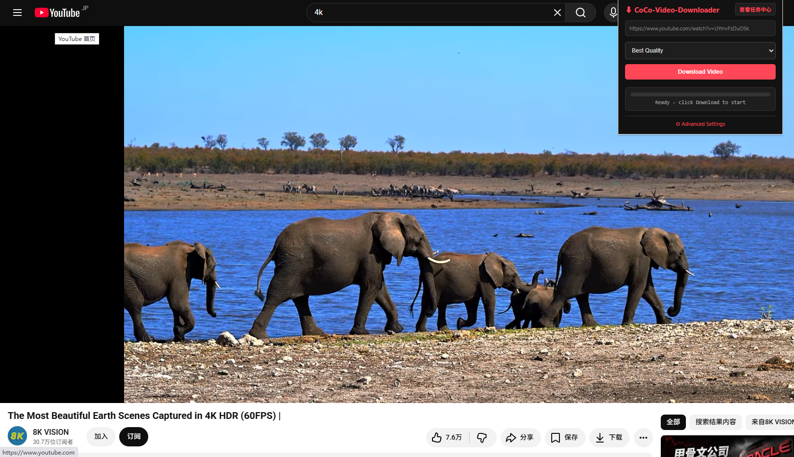
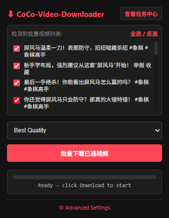
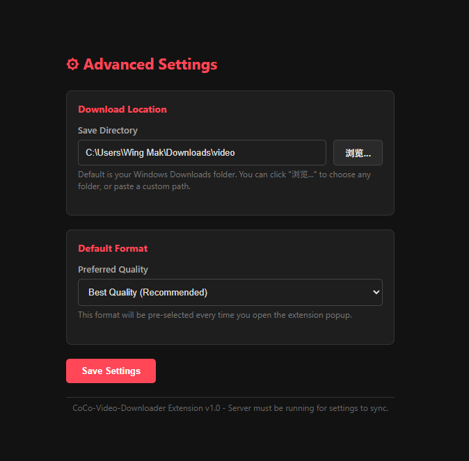

# CoCo Video Downloader

<p align="center">
  <a href="#coco-video-downloader-中文文档"><b>简体中文</b></a> | 
  <a href="#coco-video-downloader-english-documentation"><b>English</b></a>
</p>

---

# CoCo Video Downloader (中文文档)

> **全网 1000+ 平台一键视频/音频解析下载工具** — 支持 YouTube, 抖音, 快手, 今日头条, Bilibili, Twitter/X, TikTok, Instagram, Facebook, Reddit, Twitch 等各类视频网站。

[](https://opensource.org/licenses/MIT)
[](https://www.python.org/downloads/)
[](https://github.com/yt-dlp/yt-dlp)

**CoCo Video Downloader** 是一个由 Chrome/Edge 浏览器扩展与底层 Python 引擎（基于 [yt-dlp](https://github.com/yt-dlp/yt-dlp)）组合构建的高效视频下载系统。无需记忆复杂的命令行参数，只需在浏览网页时点击插件图标，即可选择画质并一键极速下载。



## 核心功能特点

- 🚀 **一键极速抓取**：自动感知当前标签页或弹窗中播放的视频，无需手动复制粘贴 URL。
- 🌐 **1000+ 网站支持**：完美支持全网主流平台（YouTube、抖音、快手、头条、Bilibili、TikTok、Twitter、Instagram 等）。
- 🧩 **国内平台深度适配**：内置快手（`kuaishou_patch`）与头条（`toutiao_patch`）深度提取补丁，解决快手 SPA 页面及头条加密流解析问题。
- 🔒 **同名文件重命名保护**：下载同名视频时，系统自动识别并重命名为 `标题.mp4`、`标题 (1).mp4`、`标题 (2).mp4`，绝不覆盖已有文件。
- 🍪 **Cookie 自动同步（Hot Cookies）**：扩展一键同步当前浏览器的登录态 Cookie 至后端，轻松下载高清或会员限定视频。
- 📊 **实时下载进度条**：百分比、下载速度、剩余时间（ETA）实时可视化呈现。
- 📁 **自定义保存路径与文件选择器**：支持在扩展高级设置中自由选择任意磁盘文件夹。
- ⚡ **开机自动后台运行**：提供静默后台启动与 Windows 开机自启脚本，告别命令行黑框。

---

## 界面截图

| 扩展弹出窗口 | 下载进度提示 | 高级设置页面 |
|:---:|:---:|:---:|
|  |  |  |

---

## 快速安装与部署指南 (Installation & Setup)

系统要求：**Windows 10 / 11**，已安装 **Python 3.8+（强烈推荐 Python 3.10+）**。

### 第一步：安装 Python (若电脑尚未安装)
1. 前往 Python 官网下载页：[python.org/downloads](https://www.python.org/downloads/)
2. 双击运行安装包，**必须勾选底部的 "Add Python to PATH"**（将 Python 添加到系统环境变量），然后点击 **Install Now** 即可完成安装。

### 第二步：一键初始化部署环境 (强烈推荐)
在项目根目录下双击运行 **`Init_Setup.bat`** 脚本。

该脚本会自动完成：
1. 检查系统 Python 环境及 PATH 变量；
2. 自动安装 Python 依赖库（`flask`, `flask-cors`, `psutil`）；
3. 检查系统全局或本地 `backend/` 目录下是否包含核心依赖：`yt-dlp.exe`、`ffmpeg.exe`（含 `ffprobe.exe`）、`deno.exe`；
4. 若缺失上述二进制文件，脚本将**自动下载官方最新版并部署至 `backend/` 文件夹**，全自动配置完成！

> **手动配置备份选项**：
> 如网络受限无法自动下载，您可以手动下载以下文件并直接放入 `backend/` 文件夹：
> - `yt-dlp.exe`: 官方 [yt-dlp Releases](https://github.com/yt-dlp/yt-dlp/releases/latest) 下载
> - `ffmpeg.exe` / `ffprobe.exe` / `ffplay.exe`: 官方 [gyan.dev Essentials](https://www.gyan.dev/ffmpeg/builds/) 解压提取
> - `deno.exe`: 官方 [Deno Releases](https://github.com/denoland/deno/releases/latest) 下载

---

## 使用教程 (Quick Start)

### 1. 启动后端服务器

我们提供了三种灵活的启动方式，您可以根据习惯选择：

- **方式 A — 开机自动后台运行 (推荐，一次配置永久生效)**：
  双击运行 `Add_to_Startup.bat`，之后每次 Windows 开机后台静默运行，无需打开任何黑框窗口。
- **方式 B — 手动前台启动 (带调试日志窗口)**：
  双击运行 `Start_Server.bat`，下载时请保持黑框窗口开启。
- **方式 C — 静默后台启动 (无黑框窗口)**：
  双击运行 `Start_Background.bat`，服务器将在后台静默运行。

### 2. 安装浏览器扩展

1. 打开 Chrome / Edge / Brave 浏览器，地址栏输入 `chrome://extensions/` ；
2. 开启页面右上角/左侧的 **“开发者模式” (Developer mode)** ；
3. 点击 **“加载已解压的扩展程序” (Load unpacked)** ；
4. 选择本项目中的 `extension/` 文件夹；
5. 点击浏览器工具栏的拼图图标 (🧩)，将 **CoCo-Video-Downloader** 钉在工具栏上。

### 3. 开始下载视频

1. 浏览任意视频网站（支持播放页面、搜索结果页弹窗、个人主页作品）；
2. 点击工具栏上的 **CoCo Downloader** 图标；
3. 选择下载画质（画质优先 Best / 1080p / 720p / 纯音频 MP3）；
4. 点击 **批量下载已选视频**，进度条实时更新，视频自动保存至本地文件夹！

---

## 常用控制脚本说明

| 脚本名称 | 功能说明 |
|---|---|
| **`Init_Setup.bat`** | 一键自动安装 Python 依赖库并自动补齐 `yt-dlp` / `FFmpeg` / `Deno` 运行环境 |
| **`Start_Server.bat`** | 启动后端 Flask 服务器（前台 CMD 窗口） |
| **`Start_Background.bat`** | 启动后端 Flask 服务器（无黑框静默运行） |
| **`Add_to_Startup.bat`** | 将后端服务器添加到 Windows 开机自启，实现零感知运行 |
| **`Remove_from_Startup.bat`** | 取消 Windows 开机自启 |
| **`Stop_Server.bat`** | 一键关闭正在运行的后端服务器进程 |
| **`Check_Server.bat`** | 诊断服务器运行状态与端口连通性 |

---

## 常见问题与排错 (FAQ & Troubleshooting)

| 常见现象 | 原因与解决方案 |
|---|---|
| 扩展显示 **"Server offline"** | 后端服务未运行。请双击运行 `Start_Server.bat` 或 `Add_to_Startup.bat`。 |
| 报错 **"yt-dlp not found"** | 请先双击运行一次 `Init_Setup.bat` 自动下载部署 `yt-dlp.exe`。 |
| 报错 **"Python not found"** | 重新安装 Python，并**务必勾选 "Add Python to PATH"**。 |
| 同名视频下载后被覆盖？ | 系统已升级同名防覆盖机制，自动命名为 `标题.mp4`、`标题 (1).mp4`、`标题 (2).mp4`。 |
| 搜索列表页点击无反应？ | 请先在搜索页点击任意视频使其**弹窗播放**，再点击扩展进行一键抓取。 |
| 修改扩展代码后未生效？ | 请前往 `chrome://extensions/` 找到本扩展，点击右下角 **刷新 (Reload)** 按钮。 |

---

## 致谢与特别鸣谢 (Acknowledgments & Credits)

本项目的诞生离不开开源社区的无私奉献。特别感谢以下优秀的开源项目与社区开发者：

- 💖 **[yt-dlp](https://github.com/yt-dlp/yt-dlp)**：全球功能最强大、更新最活跃的音视频提取核心引擎。感谢 yt-dlp 团队及广大贡献者的卓越工作！
- 🎬 **[FFmpeg](https://ffmpeg.org/)**：音视频转码、流拼接与处理领域的基石级开源工具。
- 🌶️ **[Flask](https://flask.palletsprojects.com/) & [Flask-CORS](https://flask-cors.readthedocs.io/)**：轻量高效的 Python Web 框架，为本项目的跨端通信提供稳定支撑。
- 🦕 **[Deno](https://deno.com/)**：优秀的 JavaScript 运行环境，为 YouTube 解密与极速解析提供强力加速。
- ⚡ **[psutil](https://github.com/giampaolo/psutil)**：跨平台的系统与进程管理工具。

如果您觉得本项目对您有所帮助，欢迎在 GitHub 上为本项目点亮一颗 **Star 🌟**！您的支持是开源项目持续维护与更新的最大动力！

---
---

# CoCo Video Downloader (English Documentation)

> **One-click video / audio downloader for 1000+ websites** — YouTube, TikTok, Kuaishou, Toutiao, Bilibili, Twitter/X, Instagram, Facebook, Reddit, Twitch, Vimeo, and more.

[](https://opensource.org/licenses/MIT)
[](https://www.python.org/downloads/)
[](https://github.com/yt-dlp/yt-dlp)

**CoCo Video Downloader** combines a Manifest V3 browser extension with a local Python Flask backend powered by [yt-dlp](https://github.com/yt-dlp/yt-dlp). Enjoy full CLI downloading capabilities directly from your browser toolbar — no terminal commands required.

---

## Key Features

- 🚀 **One-click Video Capture**: Automatically detects active videos on current pages, search overlays, and modals.
- 🌐 **1000+ Websites Supported**: Anything supported by `yt-dlp` (YouTube, TikTok, Twitter, Instagram, Reddit, Bilibili, Twitch, etc.).
- 🧩 **Enhanced Extraction Patches**: Custom extractor patches for Chinese video platforms (Kuaishou SPA, Toutiao DASH streams).
- 🔒 **Duplicate Filename Auto-Renaming**: Prevents overwriting files with identical titles by auto-numbering them (`Title.mp4`, `Title (1).mp4`, `Title (2).mp4`).
- 🍪 **Hot Cookie Synchronization**: Exports browser session cookies automatically to bypass anti-scraping and download high-definition videos.
- 📊 **Real-time Download Metrics**: Percentage, download speed (MB/s), and ETA progress monitoring.
- 📁 **Custom Storage Path**: Configure any output directory on your hard drive via Advanced Settings.
- ⚡ **Windows Startup Auto-Run**: Includes batch scripts for background execution and Windows startup integration.

---

## Quick Setup & Deployment

System Requirements: **Windows 10 / 11** with **Python 3.8+ (Python 3.10+ recommended)**.

### Step 1: Install Python (If not already installed)
1. Download Python 3.10+ from [python.org/downloads](https://www.python.org/downloads/).
2. Run the installer and **make sure to check "Add Python to PATH"** at the bottom.
3. Click **Install Now** to complete setup.

### Step 2: One-Click Environment Setup
Run **`Init_Setup.bat`** in the project root directory.

The setup script automatically:
1. Verifies system Python and environment variables.
2. Installs required Python packages (`flask`, `flask-cors`, `psutil`).
3. Checks for `yt-dlp.exe`, `ffmpeg.exe` (`ffprobe.exe`), and `deno.exe`.
4. If missing, **automatically downloads and places the latest binaries into the `backend/` folder**.

---

## How to Use

### 1. Launch the Backend Server

Choose one of three start options:

- **Option A — Windows Boot Auto-Start (Recommended)**:
  Run `Add_to_Startup.bat` once. The server will run silently in the background on Windows login.
- **Option B — Foreground Start (Visible Console)**:
  Run `Start_Server.bat` to keep a visible CMD window with logs.
- **Option C — Silent Background Start**:
  Run `Start_Background.bat` to launch without any console window.

### 2. Load the Extension in Browser

1. Navigate to `chrome://extensions/` in Chrome, Edge, or Brave.
2. Enable **"Developer mode"** (top right toggle).
3. Click **"Load unpacked"** and select the `extension/` folder.
4. Pin **CoCo Video Downloader** to your browser toolbar.

### 3. Start Downloading

1. Browse to any video page or click a video card.
2. Open the extension popup from your toolbar.
3. Choose format quality (**Best Quality / 1080p / 720p / MP3 Audio**).
4. Click **Download Selected Videos**.

---

## Technical Architecture

```
Browser Extension (MV3)  --HTTP/JSON (Port 18080)-->  Python Server (Flask)
                                                            |
                                                            v
                                                Spawns yt-dlp + Plugins
                                                            |
                                                            v
                                                Parses stdio Output
                                                            |
                                                            v
                                                Polls status / progress
                                                            |
                                                            v
                                                Saves to chosen folder
```

---

## Acknowledgments & Credits

This project would not be possible without the generous contributions of the open-source community. Special thanks to the following outstanding open-source projects:

- 💖 **[yt-dlp](https://github.com/yt-dlp/yt-dlp)**: The flagship media extraction engine that powers this application. Heartfelt thanks to the yt-dlp maintainers and contributors for their amazing work!
- 🎬 **[FFmpeg](https://ffmpeg.org/)**: The cornerstone tool for multimedia processing, video/audio stream merging, and format conversion.
- 🌶️ **[Flask](https://flask.palletsprojects.com/) & [Flask-CORS](https://flask-cors.readthedocs.io/)**: Lightweight, elegant Python web framework providing the stable backend communication channel.
- 🦕 **[Deno](https://deno.com/)**: Fast, modern JavaScript runtime helping accelerate complex stream deciphering for YouTube.
- ⚡ **[psutil](https://github.com/giampaolo/psutil)**: Cross-platform process and system monitoring library.

If you find this project helpful, please consider giving it a **Star 🌟** on GitHub! Your support keeps open-source software growing and thriving!

---

## License

This project is open-source under the [MIT License](LICENSE).
